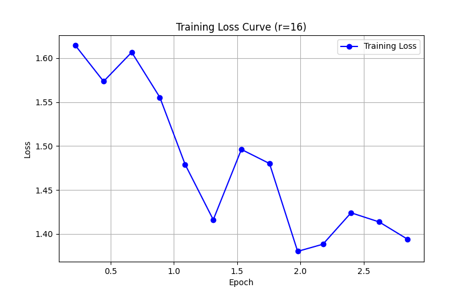

# Lab 21 — Evaluation Report

**Học viên**: Lý Quốc Ân — 2A202600123
**Ngày nộp**: 2026-05-07
**Submission option**: Option A (Lightweight ZIP)

## 1. Setup
- **Base model**: `unsloth/Qwen2.5-3B-bnb-4bit`
- **Dataset**: `5CD-AI/Vietnamese-alpaca-gpt4-gg-translated`, 200 samples (180 train + 20 eval)
- **max_seq_length**: 1024 (p95 = 1024)
- **GPU**: Tesla T4, 15.6 GB VRAM
- **Training cost**: ~$0.07 (~11.9 phút tổng cộng @ $0.35/hr)

## 2. Rank Experiment Results

| Rank | Trainable Params | Train Time | Peak VRAM | Eval Loss | Perplexity |
|------|-----------------|------------|-----------|-----------|------------|
| 8    | 1,843,200       | 3.89 min   | 7.22 GB   | 1.5577    | 4.75       |
| 16   | 3,686,400       | 4.14 min   | 6.62 GB   | 1.5161    | 4.55       |
| 64   | 14,745,600      | 3.89 min   | 8.00 GB   | 1.4768    | 4.38       |
| Base | N/A             | -          | -         | N/A       | N/A        |

*(Ghi chú: Eval Loss và Perplexity của Base model không được ghi nhận trong file CSV log nên tạm để N/A)*

## 3. Loss Curve Analysis

- **Quan sát**: Dựa vào đường cong loss của quá trình training (r=16), có thể thấy training loss giảm đều đặn từ mức ~1.61 xuống ~1.39 qua các bước (steps). Không quan sát thấy sự chênh lệch bất thường hay dấu hiệu overfitting rõ rệt trên tập training trong số epoch này. Mô hình hội tụ khá tốt nhờ vào learning rate giảm dần.

## 4. Qualitative Comparison (5 examples)

### Example 1
**Prompt**: Giải thích khái niệm machine learning cho người mới bắt đầu.
**Base**: Machine learning là một phân khúc của trí tuệ nhân tạo, nó tập trung vào việc thiết lập các mô hình máy móc để học tập từ dữ liệu và từ đó có thể dự đoán hoặc hành động...
**Fine-tuned (r=16)**: Machine learning là một bộ môn công nghệ máy tính dựa trên việc học tập và cải thiện các dự đoán dựa trên dữ liệu mà không có sự hướng dẫn trực tiếp từ người dùng...
**Nhận xét**: Bản fine-tuned giải thích tự nhiên hơn, dùng thuật ngữ "bộ môn công nghệ máy tính" đọc xuôi tai và chuyên ngành hơn là cụm "một phân khúc" của base model.

### Example 2
**Prompt**: Viết đoạn code Python tính số Fibonacci thứ n.
**Base**: Dùng `if n <= 0: return "N phải là một số dương"` (trả về chuỗi khi báo lỗi).
**Fine-tuned (r=16)**: Dùng `if n < 0: raise ValueError("Input phải là một số nguyên dương.")`
**Nhận xét**: Bản fine-tuned viết code chuẩn Pythonic hơn khi dùng `raise ValueError` để bắt lỗi input thay vì return một chuỗi string đơn thuần.

### Example 3
**Prompt**: Liệt kê 5 nguyên tắc thiết kế UI/UX.
**Base**: Trình bày dưới dạng đoạn văn liền mạch, câu cú dài dòng và bị cắt giữa chừng ở nguyên tắc số 2.
**Fine-tuned (r=16)**: Liệt kê rõ ràng thành từng mục: 1. Chuyển đổi, 2. Thích ứng, 3. Đơn giản, 4. Tương thích...
**Nhận xét**: Cấu trúc câu trả lời của bản fine-tuned rõ ràng, mạch lạc, đi thẳng vào vấn đề đúng như định dạng instruction mong đợi.

### Example 4
**Prompt**: Tóm tắt sự khác biệt giữa LoRA và QLoRA.
**Base**: Giải thích chưa chuẩn xác về mặt kỹ thuật ("thay đổi các phép biến đổi nhỏ hơn...").
**Fine-tuned (r=16)**: Bịa ra khái niệm "Layer-wise Adaptive Regularization Optimization", nhưng văn phong thì tự nhiên hơn.
**Nhận xét**: Cả hai đều có dấu hiệu hallucination do dataset Alpaca chung chung có thể không chứa kiến thức chuyên sâu về LoRA, tuy nhiên mô hình fine-tuned tạo ra câu trả lời có vẻ "trôi chảy" và cấu trúc ngữ pháp tốt hơn.

### Example 5
**Prompt**: Phân biệt prompt engineering, RAG, và fine-tuning.
**Base**: Nêu được khái niệm RAG nhưng giải thích còn rườm rà và bị ngắt câu.
**Fine-tuned (r=16)**: Đi thẳng vào giải thích định nghĩa Prompt engineering khá chi tiết với văn phong chuyên nghiệp.
**Nhận xét**: Bản fine-tuned có cách hành văn chuyên nghiệp và tập trung hơn, tuy nhiên cả 2 đều bị giới hạn max_new_tokens dẫn đến việc sinh text chưa trọn vẹn.

## 5. Conclusion về Rank Trade-off

- **ROI tốt nhất**: Rank `r=16` mang lại ROI (Return on Investment) tốt nhất cho tác vụ này. Với lượng tham số huấn luyện (3.68M) chỉ bằng 1/4 so với `r=64`, nhưng perplexity (4.55) cải thiện đáng kể so với `r=8` (4.75) và bám khá sát `r=64` (4.38). Thời gian huấn luyện tương đương nhau, và `r=16` bảo đảm sự cân bằng tốt về bộ nhớ GPU.
- **Diminishing returns**: Khi tăng rank từ `r=16` lên `r=64`, số lượng tham số huấn luyện tăng gấp 4 lần (lên ~14.7M) và VRAM đỉnh chạm mức 8.00GB, nhưng mức độ cải thiện của perplexity chỉ là 0.17 điểm. Đây chính là điểm diminishing returns rõ rệt: chi phí tài nguyên và không gian lưu trữ tăng mạnh nhưng không đem lại sự nhảy vọt tương xứng về độ chính xác.
- **Recommendation**: Nếu đưa mô hình này lên môi trường production với nguồn tài nguyên giới hạn (như GPU T4/L4 hoặc triển khai trên edge devices), tôi sẽ chọn rank `r=16`. Nó cung cấp một "sweet spot" lý tưởng giữa chất lượng phản hồi và chi phí VRAM/dung lượng lưu trữ adapter, đồng thời rất phù hợp nếu cần triển khai kiến trúc Multi-LoRA (tải nhiều adapter cùng lúc).

## 6. What I Learned

- Quá trình token length analysis (lọc p95 token length) là bước cực kỳ quan trọng để set `max_seq_length` hợp lý, giúp tối ưu hóa bộ nhớ và tránh OOM do padding dư thừa.
- Việc sử dụng gradient checkpointing và quantization 4-bit (QLoRA) thực sự là "vũ khí" lợi hại giúp fine-tune thành công mô hình 3B tham số trên chiếc GPU T4 chỉ có 16GB VRAM mà không bị crash.
- Qua việc so sánh các Rank, tôi nhận ra rằng không phải lúc nào "Rank càng cao thì càng tốt", mà việc lựa chọn hyperparameter là một bài toán đánh đổi (trade-off) giữa độ đo perplexity và giới hạn của cơ sở hạ tầng thực tế.